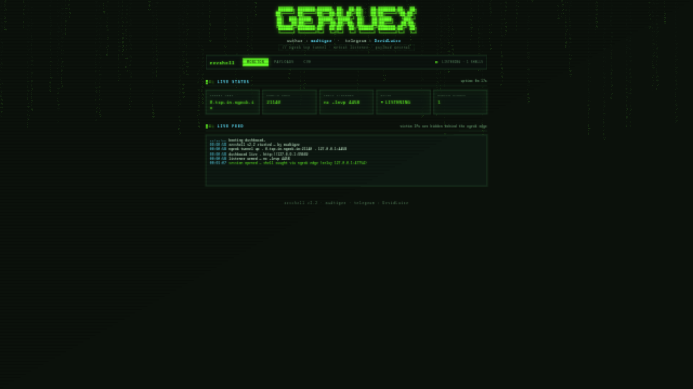
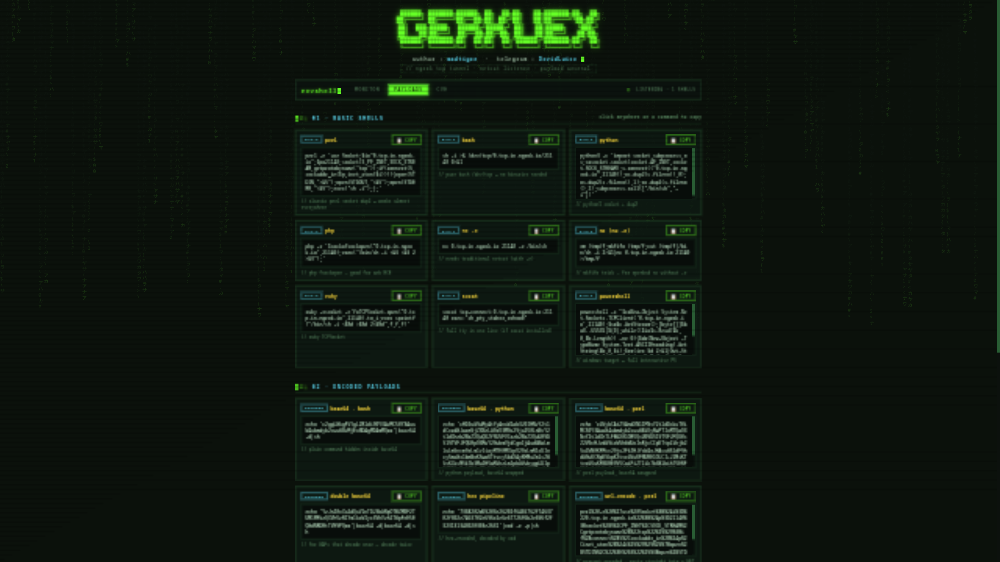
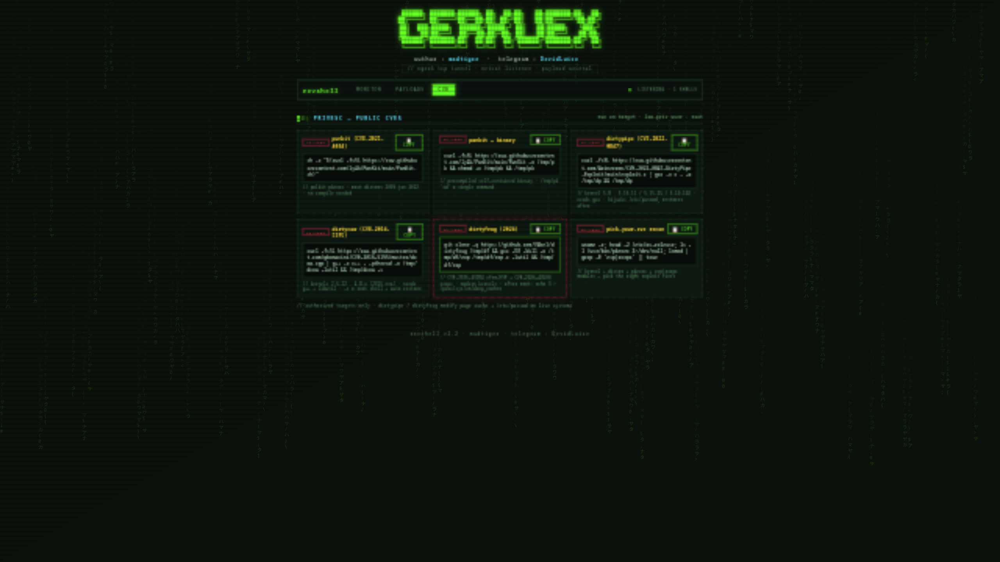

<div align="center">



# ⚡ REVSHELL

### *one command → tunnel → listener → shell*

`revshell -tcp` opens an **ngrok tcp tunnel** + **netcat listener** on the same random 4-digit port,
then serves a live **web dashboard** where every payload is generated with your real ngrok endpoint — ready to copy in one click.


</div>

---

## ⚡ quick start

```bash
# install
sudo cp revshell.py /usr/local/bin/revshell && sudo chmod +x /usr/local/bin/revshell

# fire
revshell -tcp
```

```
[+] tunnel up    : 0.tcp.in.ngrok.io:11044 → 127.0.0.1:1337
[+] dashboard    : http://127.0.0.1:38107  (monitor · payloads · cve)

╔═════════════════════════════════════════════╗
║   listening >>>>> 0.tcp.in.ngrok.io:11044   ║
╚═════════════════════════════════════════════╝

Listening on 0.0.0.0 1337
```

terminal stays clean. the shell lands in your terminal — sessions, payloads and CVEs live in the dashboard.

---

## 🕸️ dashboard

| tab | what you get |
|---|---|
| `MONITOR` | live status cards · tunnel / ports / state / shells caught · real-time session feed |
| `PAYLOADS` | 28 reverse-shell cards — **basic · encoded · bypass** — one-click copy, auto-filled with your live endpoint |
| `CVE` | public privesc one-liners with affected versions + a recon command to pick the right one |

<details>
<summary><b>📸 payloads tab</b></summary>

</details>

<details>
<summary><b>📸 privesc CVE tab</b></summary>

</details>

matrix rain · CRT scanlines · glitch logo · blinking cursor — full hacker aesthetic, served on `127.0.0.1` only.

---

## 💉 payload arsenal

| section | payloads |
|---|---|
| **basic** | perl · bash `/dev/tcp` · python · php · nc (`-e` + mkfifo no-`-e`) · ruby · socat · powershell |
| **encoded** | base64 (bash/python/perl) · **double base64** for WAFs that decode once · hex via `xxd` · url-encoded for GET params · `powershell -enc` |
| **bypass** | spaces blocked → `${IFS}` · quotes/slashes stripped → base64 wrap · `sh`/`bash` blacklisted → `$0` · openbsd nc → mkfifo relay |
| **cve** | **PwnKit** `CVE-2021-4034` · **DirtyPipe** `CVE-2022-0847` · **DirtyCOW** `CVE-2016-5195` · **DirtyFrag** `CVE-2026-43284`+`CVE-2026-43500` |

every card = one click to clipboard. click anywhere on a command copies it too.

---

## 🧰 usage

```bash
revshell -tcp                  # random 4-digit port + dashboard auto-opens
revshell -tcp -p 4444          # fixed local port
revshell -tcp --no-browser     # don't auto-open the dashboard
revshell -tcp --web 8080       # fixed dashboard port
```

<details>
<summary>requirements & teardown</summary>

- `ngrok` authenticated + `nc`/`ncat` on PATH
- teardown is safe on every exit path — session end, `Ctrl+C`, `SIGTERM`, `SIGHUP` — ngrok + netcat never get orphaned
- victim IPs stay hidden behind the ngrok edge; the monitor tracks sessions via the local relay

</details>

---

<div align="center">

## ⚠️ authorized use only

**your labs · your CTFs · your engagements**

the privesc exploits modify page cache and `/etc/passwd` on live systems —
check affected versions on each card before firing.

---

**`revshell`** · crafted by **madtiger** · `Telegram : DevidLuice`

</div>
